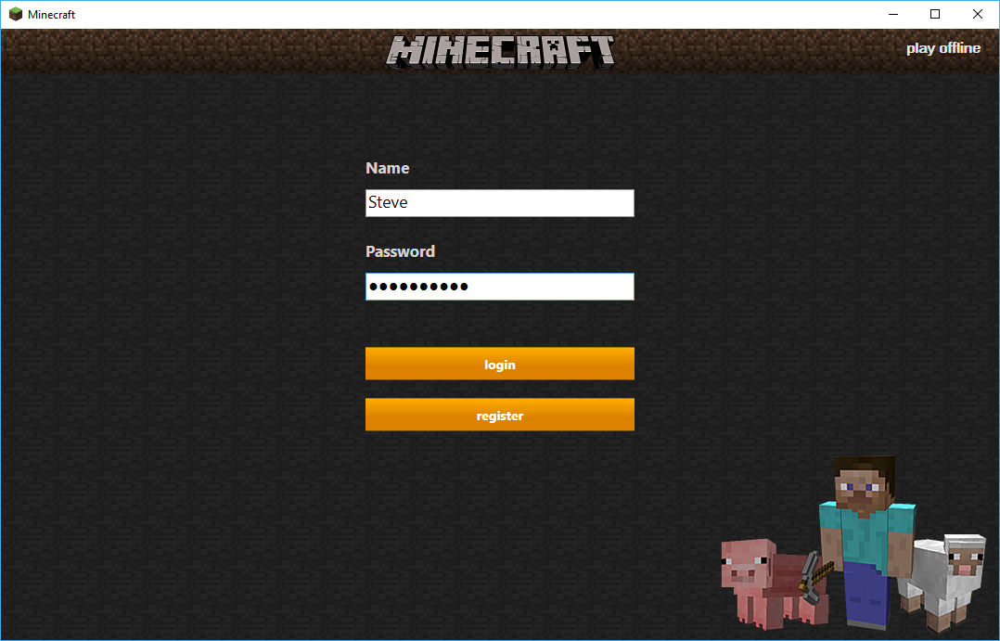
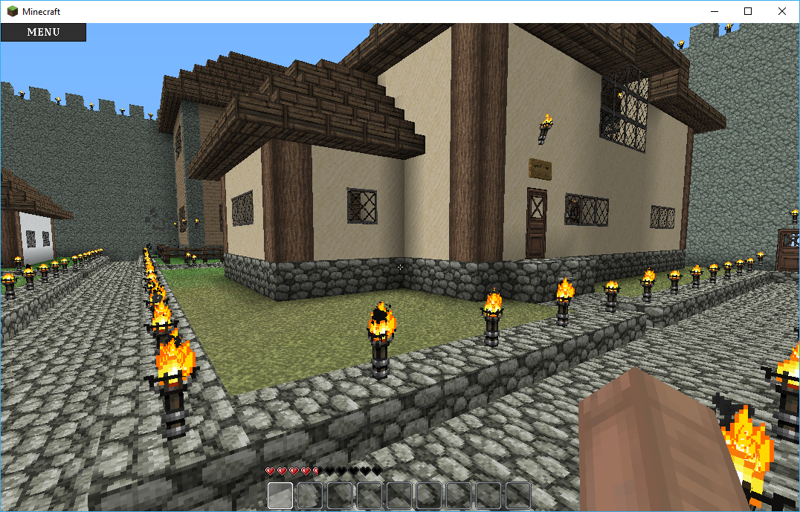
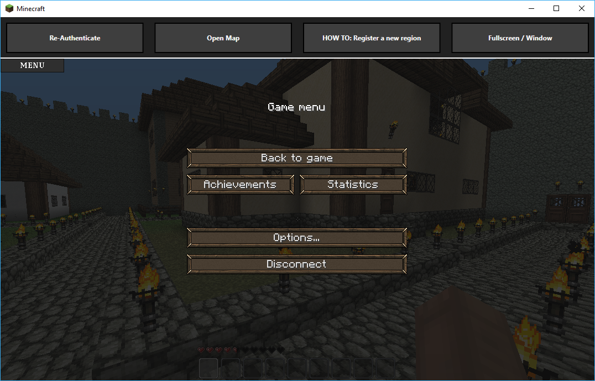

# Minecraft Beta Launcher

## Features
+ Login / Register
+ Integrated map
+ Window / Fullscreen

## Compiling

### Prerequisites
* Microsoft Visual Studio
* Java IDE (Netbeans, IntelliJ...)
* Craftbukkit 0.0.1

**To compile launcher**: 

1. Open project in Visual Studio

2. Build Solution

**To compile plugin**: 

1. Open project in java IDE

2. Add library craftbukkit-0.0.1.jar

3. Build project

## Installation

### Launcher Installation

The launcher consists of the following files/folders:

+ +.minecraft
+ +Data
+ + Retrieve the .minecraft and Data folders from the Minecraft game files.
+ Minecraft.exe
+ + Minecraft.exe is compiled from the project. 
+ settings.xml

 The settings.xml file:
 
    <?xml version="1.0" encoding="ISO-8859-1"?>
    <config>
    <PORT>1521</PORT>
    <ADDRESS>127.0.0.1</ADDRESS>
    </config>

### Plugin Installation
Copy the Account.jar file into the /plugins folder in your server directory.

- For the map to work you need to also download **Dynmap**. The region info comes from the **WorldGuard** plugin.